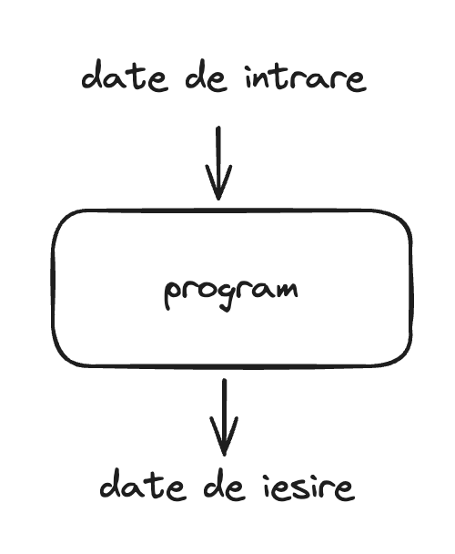

# Programe si limbaje de programare

Un program este un set de instructiuni bine definit, pe care calculatorul le executa intr-o ordine precisa, pentru a obtine un rezultat sau pentru a produce un efect dorit de utilizator. Un program poate accepta un set de date de intrare si, in urma executiei, sa produca un set de date de iesire.



## Exemple de programe

Aplicatia "Calculator" din sistemul de operare Windows este un program care accepta ca date de intrare o expresie matematica precum `22 + 7 - 13 * 2`, efectueaza calculul acesteia si, apoi afiseaza rezultatul pe ecran `3` (datele de iesire). Fiecare dintre acesti pasi (citirea datelor de intrare - expresia matematica, calculul acesteia, afisarea rezultatului pe ecran) este codificat cu un set precis de instructiuni intr-un limbaj de programare.

Datele de intrare pentru un program nu sunt intotdeauna necesare. De exemplu, aplicatia "Weather" de pe telefonul mobil nu accepta date de intrare de la utilizator, insa afiseaza ca date de iesire starea vremii.

Jocurile pe calculator sunt programe care accepta mai multe tipuri de date de intrare:

- miscarea mouse-ului
- tastele apasate
- comenzi vocale (in unele jocuri)

Si produc mai multe tipuri de date de iesire:

- vizuale, pe ecranul monitorului: miscarea protagonistului, actualizarea scorului, animatii
- audio: muzica, sunete specifice jocului

## Componentele calculatorului

Calculatorul executa sau "ruleaza" acest set de instructiuni sau "programul" pe componentele sale hardware. Un calculator este compus din:

- **CPU** (Central Processing Unit) - procesorul - este "creierul" calculatorului, executa instructiunile specificate in program.
- **Memoria RAM** (Random-access memory) - locul in care programele sunt incarcate temporar pentru a fi executate de catre procesor. Datele din memoria RAM se pierd la restartarea calculatorului.
- **Dispozitive de stocare persistenta** (hard disk, SSD) - locul in care fisierele utilizatorilor sau ale sistemului de operare sunt stocate. Acestea nu se pierd daca calculatorul este restartat.
- **Dispozitive interactive** (mouse, tastatura, monitor, boxe, touch screen) - folosite pentru a realiza interactiunea dintre calculator si utilizator.

## Limbaj masina

Procesorul unui calculator (CPU) nu poate intelege instructiunile limbajului C/C++, insa poate intelege ceea ce se numeste **limbaj masina**. O instructiune in limbaj masina arata astfel:

```
10110000 01100001
```

Aceste instructiuni sunt formate din secvente de `0` si `1`, sau secvente de **biti**. Un **bit** este unitatea fundamentala de stocare in memorie si poate lua valori de **0** sau **1**. O secventa de mai multi biti poate codifica o informatie mai complexa cum ar fi un sir de caractere "Ana are mere" sau un numar intreg 2321. Vom aprofunda acest lucru mai tarziu.

Prin comparatie, o instructiune in limbajul C/C++ arata astfel:

```
num = num + 5;
```

Aceasta instructiune adauga la variabila "num" valoarea 5. Limbajul C/C++ precum si alte limbaje de programare sunt in **format text** si pot fi intelese mai usor de utilizatori, spre deosebire de limbajul masina care sunt in **format binar** (adica compuse din secvente de biti **0** si **1**).

> 💡 Fun fact: La inceput cand calculatoarele au fost inventate, limbajele de programare inca nu existau si oamenii trebuiau sa scrie programele direct in limbaj masina.

Insa, cum ajunge calculatorul nostru sa execute instructiunile limbajului C/C++?

## Etapele executiei unui program

Pentru executia unui program scris intr-un limbaj de programare (precum C/C++), sunt necesare **doua** etape:

1. **Compilare programului** - in aceasta etapa, limbajul C/C++ este convertit in limbaj masina cu ajutorul unui **compilator**.
2. **Rularea/Executia programului** - in aceasta etapa, procesorul va rula instructiunile limbajului masina generat si va produce efectele dorite de utilizator.

Vom discuta mai in detaliu despre acestea in lectiile urmatoare.
