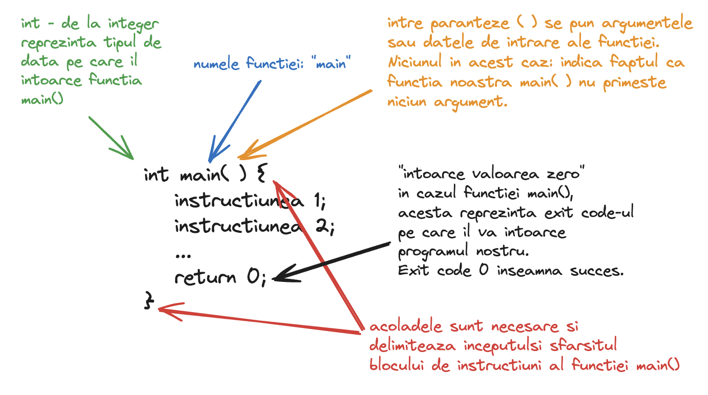

# Primul tau program: Hello world!

```C++
#include <iostream>

using namespace std;

int main() {
    cout << "Hello world!" << endl;
    return 0;
}
```

Programul de mai sus, in urma rularii, afiseaza la consola urmatorul mesaj:

```
Hello world!
```

Observam ca acest program este compus din mai multe instructiuni. Le vom explica pe fiecare pe rand:

### Instructiunea include

```C++
#include <iostream>
```

Cu ajutorul acesteia, includem in programul nostru biblioteca "iostream". O biblioteca este o colectie de cod deja existenta si implementata, pe care o putem folosi in programul nostru.

Mai precis, biblioteca "iostream" contine instructiuni care ne ajuta in citirea si afisarea datelor la consola, de exemplu instructiunile `cin` si `cout`.

Un alt exemplu de biblioteca este biblioteca "fstream" care contine instructiuni si metode pentru a citi / afisa date in fisiere text.

Putem include mai multe biblioteci in programul nostru astfel:

```C++
#include <iostream>
#include <fstream>
```

In toate programele noastre vom folosi fie biblioteca **iostream** fie biblioteca **fstream**, fie ambele, pentru a face programul nostru sa interactioneze cu date de intrare / iesire.

### Instructiunea using namespace

```C++
using namespace std;
```

Daca **nu** am pune aceasta instructiune, atunci programul nostru ar da urmatoarea eroare in urma compilarii:

```
TODO
```

Programul nostru nu recunoaste instructiunile "cout" si "endl". Desi acestea apartin de bilbioteca "iostream" pe care am inclus-o, ele fac parte si din namespace-ul "std". Un namespace pentru instructiuni este ca un director pentru fisiere. Imaginati-va ca daca vreti sa creati doua fisiere cu acelasi nume in sistemul de operare, le puteti plasa in directoare cu nume diferite pentru a evita conflictul de nume. La fel, daca aveti doua instructiuni cu acelasi nume dar care fac lucruri diferite, le puteti plasa in namespace-uri diferite.

Fara aceasta instructiune, programul nostru ar compila cu succes daca l-am scrie astfel:

```C++
#include <iostream>

int main() {
    std::cout << "Hello world!" << std::endl;
    return 0;
}
```

Observati ca am folosit:

- `std::cout` in loc de `cout`
- `std::endl` in loc de `endl`

In concluzie, `using namespace std` ii spune programului nostru sa includa toate instructiunile din namespace-ul `std`, fara a mai fi nevoie sa le specificam noi pe fiecare cu `std::`.

> ❗ Atentie! Dupa fiecare instructiune trebuie sa punem punct si virgula (;). Punctul si virgula marcheaza sfarsitul unei instructiuni si inceputul urmatoarei instructiuni. Observati ce eroare va da programul vostru daca stergeti punctul si virgula de dupa `using namespace std;`.

### Functia main()

Aceasta reprezinta punctul din care programul nostru incepe executia instructiunilor. O functie in programare este un subprogram, sau, mai bine zis, reprezinta un set de instructiuni care vor fi executate intr-o anumita ordine. Vom discuta mai mult despre functii in lectiile urmatoare.



### Afisarea

```C++
cout << "Hello world!" << endl;
```

Aceasta instructiune este cea care afiseaza mesajul "Hello world!" la consola. De fapt, aici sunt doua instructiuni. Codul de mai sus este echivalent cu:

```C++
cout << "Hello world!";
cout << endl;
```

`cout` vine de la "console output" si este o instructiune din biblioteca "iostream" pe care am inclus-o mai sus. Aceasta trebuie sa fie urmata de operatorul "<<" care trebuie sa fie urmat la randul sau de un sir de caractere (mesaj) sau de o variabila, etc. Instructiunea se incheie cu punct si virgula la final (;).

Prima instructiune de mai sus afiseaza sirul de caractere "Hello world!" la consola.

A doua instructiune "sare linia" sau, mai precis, afiseaza la consola caracterul newline care forteaza trecerea pe linia urmatoare. De exemplu programul de mai jos:

```C++
cout << "Hello world!";
cout << endl;
cout << "Hello again!";
```

Afiseaza:

```
Hello world!
Hello again!
```

Dar daca nu am sterge `cout << endl;`, atunci programul ar afisa:

```
Hello world!Hello again!
```

## Exercitii

Pornind de la programul:

```C++
#include <iostream>

using namespace std;

int main() {
    cout << "Hello world!" << endl;
    return 0;
}
```

1. Modificati programul in asa fel incat sa se afiseze la consola mesajul:

```
Speak friend and enter!
```

2. Modificati programul in asa fel incat sa se afiseze la consola mesajul:

```
Death is just another path.
Not all those who wander are lost.
```

3. "Stricati" programul pentru a observa cum se comporta compilatorul si ce mesaje de eroare va apar la consola in fiecare dintre cazurile urmatoare:

   a. Stergeti diezul `#` din fata instructiunii `include`

   b. Inlocuiti `iostream` cu o biblioteca inexistenta precum `iostreamm`

   c. Stergeti acolada deschisa `{`

   d. Stergeti acolada inchisa `}`

   e. Stergeti punctul si virgula de la sfarsitul instructiunii `cout << "Hello world!" << endl;`

   f. Stergeti instructiunea `return 0;`
